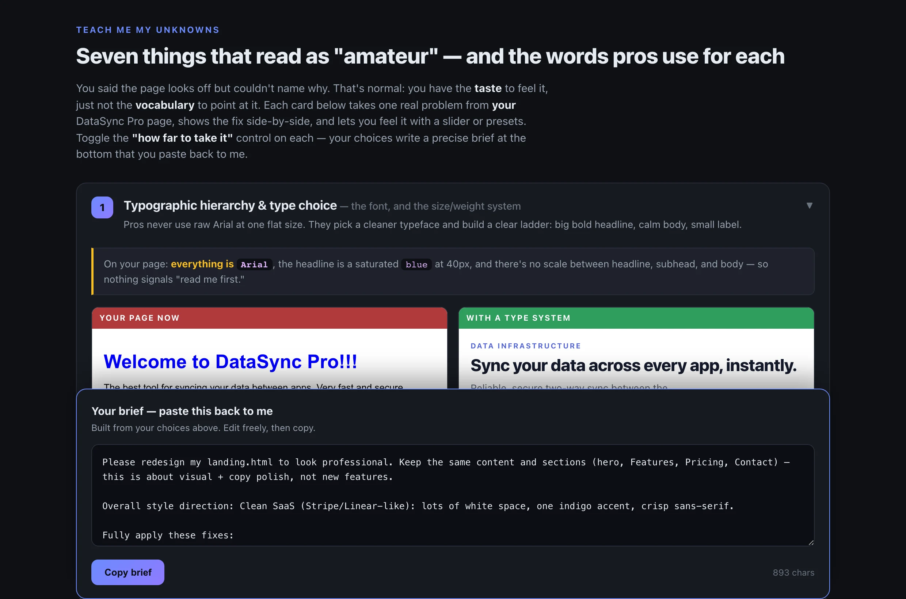
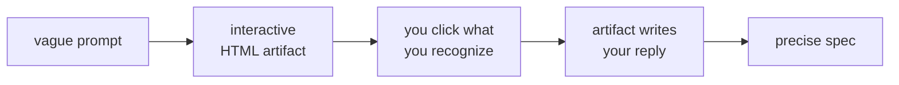
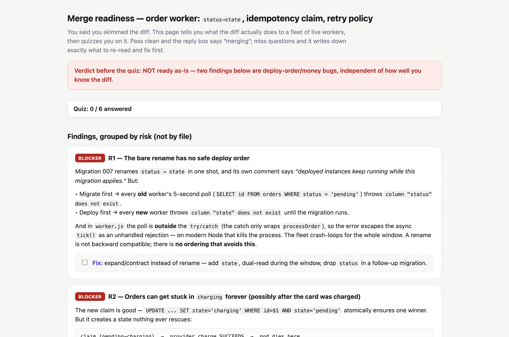

<div align="center">

# finding-unknowns

**The map is not the territory — the gap between them is your unknowns.**

[](LICENSE)
[](#install)
[](#does-it-work)
[](https://x.com/trq212/article/2073100352921215386)

**English** · [Русский](README.ru.md)

A [Claude Code](https://claude.com/claude-code) skill that turns vague prompts into precise specs.
Instead of guessing and building, Claude spends a few cheap minutes on a small **interactive HTML
artifact** that helps you *recognize* what you couldn't state — then **writes your next prompt for you.**



<sub>Real artifact from the evals: *"my landing page looks amateur, not sure why"* → an explainer that
teaches the vocabulary, then builds the redesign brief from your clicks.</sub>

</div>

## The idea

People are bad at *stating* their standards but great at *recognizing* them — show four rendered
designs and they point instantly; ask "what style?" and they shrug. Each technique turns that
recognition into a spec:



The gap has four parts; quality is bottlenecked by the two you can't just be asked about:

| | you know it | you don't |
|---|---|---|
| **user knows it** | already in the prompt | **unstated taste & house rules** |
| **user doesn't** | open questions | **factors nobody considered** |

## Techniques

Claude picks the one that fits and builds an artifact for it. Blueprints in
[`SKILL.md`](skills/finding-unknowns/SKILL.md).

| Phase | Technique | What it pulls out of your head |
|-------|-----------|--------------------------------|
| Pre | Blindspot pass | your unknown unknowns, as copyable prompt fixes |
| Pre | Teach me my unknowns | the vocabulary for taste you can't articulate |
| Pre | Four design directions | which rendered look you point at (steal/skip per element) |
| Pre | Mock before you wire | placement & interaction, before real code |
| Pre | Brainstorm on an effort axis | which interventions resonate, afternoon → quarter |
| Pre | The interview | decisions ordered by architectural blast radius |
| Pre | Point at a reference | proof the reference was understood before porting |
| Pre | The tweakable plan | plan sign-off, sorted by likelihood-of-tweaking |
| During | Implementation notes | every plan-vs-reality deviation + bullets for attempt #2 |
| Post | The buy-in doc | reviewer objections, pre-answered |
| Post | Quiz me before I merge | whether *you* understand your own diff |

## Install

```
/plugin marketplace add droppedoutofcontext/finding-unknowns
/plugin install finding-unknowns@finding-unknowns
```

Or copy the skill folder directly — `cp -r skills/finding-unknowns ~/.claude/skills/`. It's a
standard `SKILL.md` skill, so other agents that read the Agent Skills layout can load it too.

## Usage

Mostly you don't invoke it — it triggers on vague, aesthetic, or risky requests ("make it nicer",
"add sharing, you decide the details", "am I ready to merge this?"). To call it directly, name the
technique or the skill:

> *"interview me about this feature"* · *"do a blindspot pass on this module"* ·
> *"quiz me before I merge"* · `/finding-unknowns`

## Does it work?

Four realistic tasks, four binary checks each, one run per configuration:

| Task | with skill | baseline |
|------|:---:|:---|
| vague aesthetic ask | **4/4** | 0/4 — silent redesign with invented facts |
| ambiguous feature | **4/4** | 1/4 — static decision sheet, no loop |
| implementation notes | **4/4** | 2/4 — learnings stuck in chat, lost for attempt #2 |
| merge quiz | **4/4** | 0/4 — good review, no comprehension check |

Baselines often *find* the same problems — the skill's edge is the loop, not raw insight: it turns
findings into your decisions and your next prompt instead of a wall of text. Small sample; rerun via
[`evals/`](skills/finding-unknowns/evals/evals.json). Tested on Fable 5 and Opus 4.8.

<div align="center">

<br><sub>A post-implementation artifact: risk-grouped review + a quiz you must pass before merging.</sub>
</div>

## Credits

Ideas by [Thariq Shihipar](https://x.com/trq212) — the
[field guide](https://x.com/trq212/article/2073100352921215386) and its
[demo artifacts](https://thariqs.github.io/html-effectiveness/unknowns/index.html). This repo is an
independent packaging of that workflow as a skill; the text is an original synthesis, not a copy.
Not affiliated with Thariq or Anthropic. MIT.
