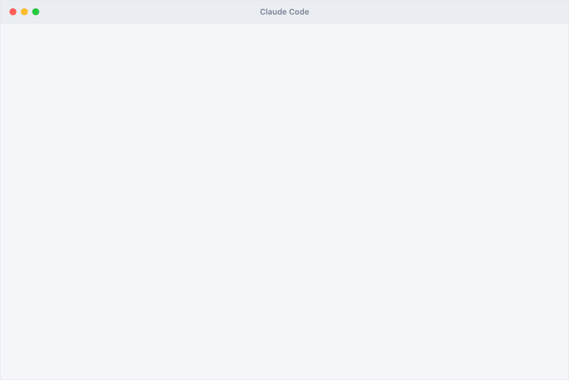

<div align="center">

# finding-unknowns

**A Claude Code skill for prompts that are not specs yet.**

[](LICENSE)
[](#install)
[](https://x.com/trq212/article/2073100352921215386)

**English** · [Русский](README.ru.md)



</div>

## Why

Vibe coding often fails before code generation starts. The agent receives a prompt that is missing
requirements, taste constraints, edge cases, or review criteria. It fills the gaps with defaults and
returns something that works, but is not the thing you meant.

Typical prompts:

> "Make it nicer"  
> "Add sharing, you decide the details"  
> "Port it from this reference"  
> "Am I ready to merge this?"

`finding-unknowns` adds a short discovery pass before expensive implementation. The agent builds a small
self-contained HTML artifact where you can choose options, confirm assumptions, mark risks, or compose a
design direction from parts. The artifact then generates the next prompt for the chat.

The loop is:

**render → choose → assemble prompt → implement.**

## Example

If you ask "make this dashboard better", the skill should not immediately rewrite the UI. It can first
render four directions for the same screen: a calm ops console, a dense analytics view, an editorial
version, and a more terminal-like version.

You mark: "use C's density, A's header, B's palette, definitely not D". The artifact turns that into an
implementation prompt. The agent gets concrete constraints instead of "make it better".

## Install

```text
/plugin marketplace add droppedoutofcontext/finding-unknowns
/plugin install finding-unknowns@finding-unknowns
```

Or copy the skill directly:

```text
cp -r skills/finding-unknowns ~/.claude/skills/
```

## What's inside

The skill picks a technique for the kind of unknown:

- **Blindspot pass** — find hidden requirements in unfamiliar code or domains.
- **Teach me my unknowns** — teach vocabulary for taste, quality, or visual decisions.
- **Four design directions** — show rendered variants and compose a fifth direction from parts.
- **Mock before you wire** — test placement and interaction before real implementation.
- **Brainstorm on an effort axis** — sort interventions from quick win to quarter-long bet.
- **The interview** — extract architectural decisions by blast radius: storage, auth, API, failure modes.
- **Point at a reference** — verify behavior before porting a reference implementation.
- **The tweakable plan** — review the parts of a plan most likely to change, not a linear todo list.
- **Implementation notes** — record plan-vs-reality gaps during a long build.
- **The buy-in doc** — pre-answer reviewer or stakeholder objections.
- **Quiz me before I merge** — check whether you understand your own diff before merging.

Full rules and technique blueprints live in [`SKILL.md`](skills/finding-unknowns/SKILL.md) and
[`references/techniques.md`](skills/finding-unknowns/references/techniques.md).

## Artifact contract

Each artifact is one HTML file with no CDN, fetch, or external dependencies. It must open from `file://`,
keep all JS/CSS inline, and act as a throwaway UI for making decisions.

The required part is the assembled reply: a textarea with the next prompt and a copy button. If the
artifact does not turn user clicks into a concrete prompt diff, it does not close the loop.

Before handing an artifact over, the skill verifies it with:

```text
node scripts/verify_artifact.mjs <file>
```

## When not to use it

If the task is small and clear, this adds overhead. You do not need an artifact for "fix this typo" or
"rename this variable".

Use it when the cost of a wrong assumption is higher than a few minutes of discovery.

## Does it work?

I ran a small eval set: four realistic tasks, four binary checks each. With the skill: **16/16**. Without
it: **3/16**.

This is not a benchmark or a big scientific claim. It is a sanity check. The value is not that the agent
magically becomes smarter; it is that the agent turns assumptions into explicit user decisions before
expensive implementation.

Evals are in [`skills/finding-unknowns/evals/`](skills/finding-unknowns/evals/).

## Post kit

Russian post draft, short versions, CTAs, and visual notes live in [`docs/post-kit.ru.md`](docs/post-kit.ru.md).

## Credits

Inspired by [Thariq Shihipar](https://x.com/trq212)'s
[`A Field Guide to Fable: Finding Your Unknowns`](https://x.com/trq212/article/2073100352921215386) and
[demo artifacts](https://thariqs.github.io/html-effectiveness/unknowns/index.html).

This repo is an independent packaging of the workflow as a Claude Code skill. Not affiliated with Thariq
or Anthropic. MIT.
