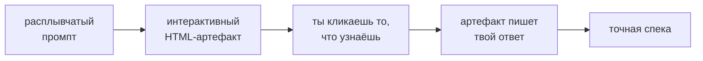

<div align="center">

# finding-unknowns

**Карта — не территория; разрыв между ними — это твои неизвестные.**

[](LICENSE)
[](#установка)
[](#а-это-работает)
[](https://x.com/trq212/article/2073100352921215386)

[English](README.md) · **Русский**

Скилл для [Claude Code](https://claude.com/claude-code), который превращает расплывчатые промпты в
точные спеки. Вместо того чтобы гадать и строить, Claude тратит несколько дешёвых минут на маленький
**интерактивный HTML-артефакт**, который помогает тебе *узнать* то, что ты не мог сформулировать, —
и **сам пишет твоё следующее сообщение.**


<sub>Настоящий артефакт из эвалов: *«мой лендинг выглядит любительски, не пойму почему»* → объяснялка,
которая учит словарю, а потом собирает бриф на редизайн из твоих кликов.</sub>

</div>

## Идея

Люди плохо *формулируют* свои стандарты, но отлично их *узнают* — покажи четыре отрисованных варианта
дизайна, и человек ткнёт мгновенно; спроси «какой стиль?» — пожмёт плечами. Каждая техника превращает
это узнавание в спеку:



Разрыв состоит из четырёх частей; качество упирается в те две, о которых тебя просто не спросишь:

| | ты это знаешь | ты не знаешь |
|---|---|---|
| **юзер это знает** | уже в промпте | **невысказанный вкус и негласные правила** |
| **юзер не знает** | открытые вопросы | **факторы, которых никто не учёл** |

## Техники

Claude выбирает подходящую и строит под неё артефакт. Блюпринты — в
[`SKILL.md`](skills/finding-unknowns/SKILL.md).

| Фаза | Техника | Что вытаскивает из твоей головы |
|------|---------|---------------------------------|
| До | Blindspot pass | твои unknown unknowns — в виде готовых вставок в промпт |
| До | Teach me my unknowns | словарь для вкуса, который не можешь выразить словами |
| До | Four design directions | какой отрисованный вид ты выберешь (steal/skip по элементам) |
| До | Mock before you wire | размещение и взаимодействие — до реального кода |
| До | Brainstorm on an effort axis | какие интервенции откликаются, от «за полдня» до «на квартал» |
| До | The interview | решения по убыванию архитектурной цены ошибки |
| До | Point at a reference | доказательство, что референс понят до портирования |
| До | The tweakable plan | согласование плана, отсортированного по вероятности правок |
| Во время | Implementation notes | каждое расхождение плана с реальностью + пункты для попытки №2 |
| После | The buy-in doc | возражения ревьюера, отвеченные заранее |
| После | Quiz me before I merge | понимаешь ли *ты* собственный дифф |

## Установка

```
/plugin marketplace add droppedoutofcontext/finding-unknowns
/plugin install finding-unknowns@finding-unknowns
```

Либо скопируй папку скилла напрямую — `cp -r skills/finding-unknowns ~/.claude/skills/`. Это скилл
стандартного формата `SKILL.md`, поэтому его подхватят и другие агенты, читающие раскладку Agent Skills.

## Использование

Обычно вызывать вручную не нужно — срабатывает на расплывчатых, эстетических или рискованных запросах
(«сделай поприятнее», «добавь шеринг, детали на твоё усмотрение», «я готов к мержу?»). Чтобы позвать
напрямую, назови технику или скилл:

> *«проинтервьюируй меня об этой фиче»* · *«сделай blindspot pass по этому модулю»* ·
> *«прогони меня квизом перед мержем»* · `/finding-unknowns`

## А это работает?

Четыре реалистичные задачи, по четыре бинарные проверки в каждой, один прогон на конфигурацию:

| Задача | со скиллом | база |
|--------|:---:|:---|
| расплывчатый эстетический запрос | **4/4** | 0/4 — молчаливый редизайн с выдуманными фактами |
| неоднозначная фича | **4/4** | 1/4 — статичный лист решений, без петли |
| implementation notes | **4/4** | 2/4 — выводы застряли в чате, потеряны для попытки №2 |
| merge quiz | **4/4** | 0/4 — хороший ревью, но без проверки понимания |

База часто *находит* те же проблемы — преимущество скилла в петле, а не в интеллекте: он превращает
находки в твои решения и твой следующий промпт вместо стены текста. Выборка маленькая; перезапустить
можно через [`evals/`](skills/finding-unknowns/evals/evals.json). Протестировано на Fable 5 и Opus 4.8.

<div align="center">

<br><sub>Пост-имплементационный артефакт: ревью по риску + квиз, который нужно пройти перед мержем.</sub>
</div>

## Благодарности

Идеи — [Thariq Shihipar](https://x.com/trq212): [полевой гид](https://x.com/trq212/article/2073100352921215386)
и его [демо-артефакты](https://thariqs.github.io/html-effectiveness/unknowns/index.html). Этот репозиторий —
независимая упаковка этого воркфлоу в скилл; текст здесь — оригинальный синтез, а не копия. Не аффилирован
с Thariq или Anthropic. MIT.
